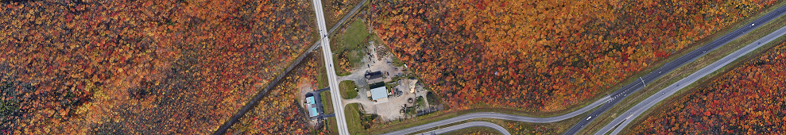
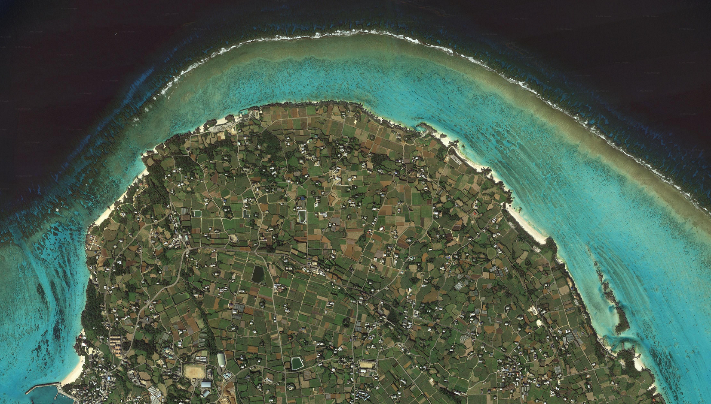

# Satellite Imagery Downloader

A rewrite of the [original program](https://github.com/andolg/satellite-imagery-downloader) by [andolg](https://github.com/andolg) in Rust.

A Rust program and library that downloads a rectangular map region by its geographic coordinates and saves it as a PNG image. It works by downloading map tiles at a given zoom level and cropping border tiles to fit the region.

This program should work with any raster map that uses [Web Mercator](https://en.wikipedia.org/wiki/Web_Mercator_projection), including Google Maps, Esri and OpenStreetMap.


<nobr><sup><sup>© 2023 Google</sup></sup></nobr>

## Usage

> Please note that downloading map tiles without using the API may violate the map service's terms of use.

Install:

```cmd
cargo install satellite_imagery_downloader
```

Use as a library:

```cmd
cargo add satellite_imagery_downloader
```

On the first run, the program will create a preferences file. Run the program again. Now you will be asked to enter the coordinates and zoom level in the command line.

- Enter the coordinates of the top-left and bottom-right corners of a rectangular region as decimal degrees (latitude before longitude) with any separator you want, e.g. <nobr>`40.612123, -73.895381`</nobr>.

- Enter the zoom level at which you want to get the image. [This article](https://learn.microsoft.com/en-us/bingmaps/articles/understanding-scale-and-resolution) explains how it affects the scale and resolution.

Google Maps satellite imagery will be used by default.

### Preferences file

> `"channels"` is not supported, all images downloaded are RGBA.
- `"url"` is the URL template that the program will use to download map tiles.
- `"tile_size"` is the size of a single tile in pixels. The default is 256.
- `"dir"` is the directory where your images will be saved. If the directory doesn't exist, it will be created automatically.
- `"headers"` are the headers that the program will use to make HTTP requests.

Optional:

`preferences.json` can also be used to specify the coordinates and zoom level. If you leave one of the following fields empty, you will be asked to use the command line instead.

- `"tl"` and `"br"` are the coordinates of the top-left and bottom-right corners of a rectangular region.
- `"zoom"` is the zoom level.

If you encounter any problems with the program, feel free to open an issue.

## Tile URL

Here are some tile URLs that you can use:

- Google maps satellite imagery: `https://mt.google.com/vt/lyrs=s&x={x}&y={y}&z={z}` (default `"url"`).
- Other Google Maps tile types: https://stackoverflow.com/questions/23017766/google-maps-tile-url-for-hybrid-maptype-tiles
- OpenStreetMap: `https://tile.openstreetmap.org/{z}/{x}/{y}.png` or `https://tile.osmand.net/df/{z}/{x}/{y}.png`
- Esri satellite imagery: `https://services.arcgisonline.com/arcgis/rest/services/World_Imagery/MapServer/tile/{z}/{y}/{x}`

If you need to download an image from a different map service, you can try to get the tile URL using your browser. Open the map, then open developer tools (Ctrl+Shift+I) and go to the Network panel. When you refresh the page or scroll the map, it logs the resources that are being downloaded. Find a tile, copy the URL and replace its coordinate and zoom values with `{x}`, `{y}` and `{z}`.


---

## Examples

Images in full resolution: https://mega.nz/folder/7sxTwALS#n2bFCYk9JsiU7nbVQH-ntw


<nobr><sup><sup>© 2022 Google</sup></sup></nobr>


<nobr><sup><sup>© 2022 Google</sup></sup></nobr>


<nobr><sup><sup>© OpenStreetMap</sup></sup></nobr>
